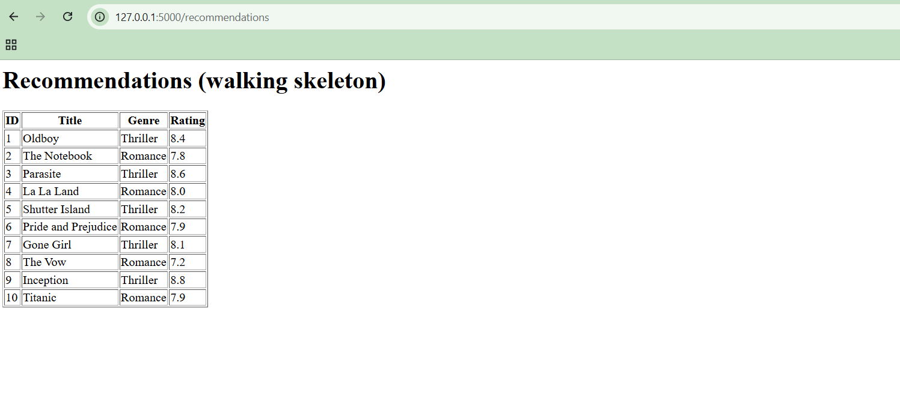

# Architecture
## Container

```
+-------------+    HTTPS     +----------------+   redirect    +------------------+
|    User     | -----------> |    Web App     | ------------> |  Streaming Site  |
| (phone/desk)| <----------- |    (React)     | watch_session | (mock in demo)   |
+-------------+ rendered UI  +----------------+      id       +------------------+
                                     |                                 |
                                     | REST/JSON                       | watch events
                                     | JWT + X-Profile-Id              | signed JSON (HMAC)
                                     v                                 |
                             +----------------+                        |
                             |  API (FastAPI) | <----------------------+
                             +----------------+
                                |           |
                          SQL   |           |  GET/SET lists
                                v           v
                        +------------+  +---------+
                        | PostgreSQL |  |  Redis  |
                        +------------+  +---------+

        +---------------+   CSV    +------------------+   bulk upsert   +------------+
        | Movie dataset | -------> | Catalog Importer | --------------> | PostgreSQL |
        +---------------+          +------------------+                 +------------+
```

> Mọi "Service" bên dưới là module Python trong **một** app FastAPI, gọi nhau bằng function call. Không có service nào deploy riêng.

> PostgreSQL và Redis là kiến trúc đích. Bản M2 (walking skeleton) chạy SQLite, xem ADR-1.

## Component (API)

```
   Web App                                   Streaming Site
      | REST/JSON                                   | signed event
      v                                             v
+---------------------+                 +----------------------+
| Auth middleware     |                 | Signature verifier   |
| JWT + X-Profile-Id  |                 | HMAC + timestamp     |
+---------------------+                 +----------------------+
      | account_id, profile_id                      | verified event
      v                                             v
+--------------------------------------------------------------+
| Routers: auth | profiles | recommendations | movies | callback|
+--------------------------------------------------------------+
   |            |               |                |           |
   | login      | profile CRUD  | profile ids,   | score /   | watch
   |            |               | theme          | watched   | event
   v            v               v                v           v
+--------+  +---------+  +----------------+  +--------+  +---------+
| Auth   |  | Profile |  | Recommendation |  | Rating |  | Watch   |
| Service|  | Service |  | Service        |  | Service|  | Service |
+--------+  +---------+  +----------------+  +--------+  +---------+
   |            |               |   |             |           |
   |            |               |   | get/set     |           |
   |            |               |   | list        | invalidate|
   |            |               |   v             v           v
   |            |               |  +--------------------------+
   |            |               |  |  Cache adapter  -> Redis |
   |            |               |  +--------------------------+
   |   SQL      |   SQL         |  SQL           SQL        SQL
   v            v               v                v           v
+--------------------------------------------------------------+
| Repositories (SQLAlchemy)  ------------------->  PostgreSQL  |
+--------------------------------------------------------------+
```

### Recommendation Service

```
 profile ids, theme
        |
        v
+--------------------+
| Signal counter     |  BR5
+--------------------+
    | < 5       | >= 5
    v           v
+-----------+  +----------------+
| Cold-start|  | Personalized   |
| BR6, BR8  |  | BR4            |
+-----------+  +----------------+
        \         /  candidates
         v       v
     +-----------------------+
     | Filter                |  BR1 watched, BR2 age, theme
     +-----------------------+
                |
                v
     +-----------------------+
     | Ranker                |  BR9
     +-----------------------+
                | top 10 per profile
                v
     +-----------------------+
     | Merger (2 profiles)   |  BR10, US05
     +-----------------------+
                | merged list
                v
     +-----------------------+
     | Assembler             |  BR7 unique, BR3 max 10
     +-----------------------+
```

# Data model

## ERD (core)

```
+------------------+ 1        1..* +--------------------+
| account          |---------------| profile            |
| PK id            |               | PK id              |
|    email         |               | FK account_id      |
|    password_hash |               |    display_name    |
+------------------+               |    max_age_rating  |
                                   +--------------------+
                                       | 1            | 1
                                       |              |
                                       | 0..*         | 0..*
                              +----------------+  +-------------------+
                              | rating         |  | watch_history     |
                              | PK id          |  | PK profile_id     |
                              | FK profile_id  |  | PK movie_id       |
                              | FK movie_id    |  |    source         |
                              |    score 1-10  |  |    first_watched  |
                              +----------------+  +-------------------+
                                       | 0..*         | 0..*
                                       |              |
                                       | 1            | 1
                                   +--------------------+ 1        0..* +-------------+
                                   | movie              |---------------| movie_genre |
                                   | PK id              |               | FK movie_id |
                                   |    title           |               | FK genre_id |
                                   |    release_year    |               +-------------+
                                   |    runtime_minutes |                      | 0..*
                                   |    age_rating      |                      |
                                   |    rating_count    |                      | 1
                                   |    avg_rating      |               +-------------+
                                   +--------------------+               | genre       |
                                                                        | PK id       |
                                                                        |    name     |
                                                                        +-------------+
```

## ERD (Streaming Site tracking)

```
+-----------------+ 1       0..* +--------------------+ 0..*       1 +-----------+
| profile         |--------------| watch_session      |--------------| movie     |
+-----------------+              | PK id              |              +-----------+
                                 | FK profile_id      |
                                 | FK movie_id        |
                                 |    partner         |
                                 |    status          |
|    expires_at      |
                                 +--------------------+
                                           | 1
                                           |
                                           | 0..*
                                 +--------------------+
                                 | watch_event        |
                                 | PK id              |
                                 | FK watch_session_id|
                                 |    event_id        |
                                 |    event_type      |
                                 |    watched_seconds |
                                 |    runtime_seconds |
                                 +--------------------+
```

## Table description

| Table | Key / constraint |
|-------|------------------|
| account | `email` UNIQUE, `password_hash` NOT NULL |
| profile | FK `account_id` CASCADE · UNIQUE(`account_id`, `display_name`) · `max_age_rating` default 18 |
| movie | `rating_count` ≥ 0 · `avg_rating` generated from rating sum / count · `age_rating` ≥ 0 |
| genre, movie_genre | `name` UNIQUE · PK(`movie_id`, `genre_id`) |
| rating | `score` CHECK 1–10 · UNIQUE(`profile_id`, `movie_id`) → re-rate = upsert (US02) |
| watch_history | PK(`profile_id`, `movie_id`) · `source` IN (manual, partner_site) |
| watch_session | `id` random uuid, given to the Streaming Site · `status` IN (open, completed, expired) |
| watch_event | UNIQUE(`watch_session_id`, `event_id`) → duplicate callbacks ignored · `watched_seconds` ≤ `runtime_seconds` |

## Business rules

| BR | Data | Enforced by |
|----|------|-------------|
| BR1 | watch_history | Query: exclude rows in watch_history. Row written on manual mark, or on partner progress ≥ 90% |
| BR2 | movie.age_rating, profile.max_age_rating | Query: `age_rating <= max_age_rating` |
| BR3 | — | Code: `LIMIT 10` |
| BR4 | movie.avg_rating | Query: ≥ 6.0, personalized pool only |
| BR5 | rating + watch_history | Query: count distinct movies ≥ 5 |
| BR6 | movie | Code path when BR5 fails |
| BR7 | — | Code: dedupe in Assembler |
| BR8 | movie.rating_count | Query: ≥ 100, cold-start pool only |
| BR9 | movie.rating_count, release_year | `ORDER BY score, rating_count DESC, release_year DESC` |
| BR10 | profile.account_id · rating/watch_history keyed by profile_id | FK; service rejects companion from another account |

## User story → tables

| US | Tables |
|----|--------|
| US01 | movie, rating, watch_history |
| US02 | rating |
| US03 | rating, movie, movie_genre |
| US04 | watch_history, watch_session, watch_event |
| US05 | profile, rating |
| US06 | genre, movie_genre |
| US07 | movie |
| US08 | — (code) |
| US09 | rating, watch_history |
| US10 | account, profile |

# API design

#### Core RESTful APIs (P0 User Stories)

| Method | Path | Input | Success | Errors |
|---|---|---|---|---|
| **POST** | `/api/v1/auth/login` | `email`, `password` | **200** · `access_token` (JWT), list of profiles | **400** missing required credentials<br>**401** invalid email or password *(US01, US10)* |
| **GET** | `/api/v1/profiles` | *Header:* `Authorization: Bearer <access_token>` | **200** · list of profiles belonging to the account (`id`, `display_name`, `max_age_rating`) | **401** unauthorized account token *(US10)* |
| **POST** | `/api/v1/profiles/select` | *Header:* `Authorization: Bearer <access_token>`<br>`profile_id` | **200** · `active_profile_id`, `redirectTo: "/recommendations"` | **401** unauthorized account token<br>**404** profile not found or does not belong to account *(US10, BR10)* |
| **GET** | `/api/v1/recommendations/setup/genres` | *Header:* `Authorization: Bearer <access_token>`, `X-Profile-Id: <profile_id>` | **200** · list of available genres/themes (e.g., Action, Horror) | **401** missing or invalid JWT<br>**403** missing or invalid `X-Profile-Id` header *(US06)* |
| **GET** | `/api/v1/recommendations` | *Header:* `Authorization: Bearer <access_token>`, `X-Profile-Id: <profile_id>`<br>*Query:* `genre_id` *(optional)*, `companion_profile_id` *(optional — triggers the ratio-merge in US05; must belong to the same account as BR10 requires)* | **200** · list of 10 unique movies (personalized, cold-start, or merged if `companion_profile_id` is present) | **401** unauthorized JWT<br>**403** missing active profile header<br>**404** `companion_profile_id` not found or belongs to another account (BR10)<br>**422** invalid `genre_id` query parameter *(US01, US03, US05; BR1–BR10)* |
| **POST** | `/api/v1/ratings` | *Header:* `Authorization: Bearer <access_token>`, `X-Profile-Id: <profile_id>`<br>`movie_id`, `score` (1-10) | **201** · rating created or updated (upsert) | **400** score outside 1-10 range<br>**401** unauthorized<br>**404** movie_id not found *(US02)* |
| **POST** | `/api/v1/movies/:id/watch` | *Header:* `Authorization: Bearer <access_token>`, `X-Profile-Id: <profile_id>` | **200** · movie marked as watched manually in `watch_history` | **401** unauthorized<br>**404** movie ID not found in database *(US04, BR1)* |

#### Partner Callback API (External Streaming Integration)

| Method | Path | Input | Success | Errors |
|---|---|---|---|---|
| **POST** | `/api/v1/callback/watch-event` | *Header:* `X-Signature: <hmac_sha256>`<br>`watch_session_id`, `event_id`, `watched_seconds`, `runtime_seconds`<br>*(note: `profile_id` is not passed directly — it is resolved server-side from `watch_session_id` via the `watch_session` table)* | **200** · watch event recorded (written to `watch_history` if progress ≥ 90%) | **401** invalid HMAC signature or expired timestamp<br>**404** watch_session_id not found<br>**422** duplicate callback event_id ignored *(BR1)* |

# Walking skeleton

**Route:** `GET /recommendations` · **Table:** `movie` (12 rows seeded from `data/movies.csv`)

**How to know it worked:** `http://localhost:5000/recommendations` shows an HTML table listing 10 movies (title, genre, rating), read live from the SQLite database — not hardcoded in the route.



**The query behind the page:**

```sql
SELECT id, title, genre, rating FROM movie ORDER BY id LIMIT 10;
```

No business rules (BR1–BR10) are applied yet at this stage — this route will be extended with filtering, personalization, and cold-start logic in Sprint 3/4, on top of this same working route.

# Design decisions

### ADR-1: SQLite instead of PostgreSQL/Redis for M2

**Options:** SQLite (single file, no setup) · PostgreSQL via Docker · PostgreSQL installed directly on the machine.

**Chose:** SQLite, with in-memory caching via a `Cache adapter`. The Container diagram above shows the target architecture; migration happens gradually from Sprint 3.

**Why:** The instructor clones and runs the project via SETUP.md in 15 minutes. PostgreSQL + Redis require Docker or separate installation plus connection strings — the most likely point of failure in that first step. Schema is written in SQLAlchemy without Postgres-specific types (`citext`, native `uuid`), so switching DB later is just a connection-string change; `PRAGMA foreign_keys=ON` makes SQLite enforce FK/CASCADE the same way Postgres does. The mock Streaming Site runs as a route in the same app (`/mock-partner`), so no second container is needed yet.

**What would change our mind:** Concurrent writes from multiple real users, or measuring `/recommendations` slower than our latency target without an out-of-process cache.

---

### ADR-2: One FastAPI app with internal modules, not microservices

**Options:** One FastAPI app with Services as internal modules (function calls) · Each domain (Auth, Profile, Recommendation, Rating, Watch) as a separate microservice communicating over the network.

**Chose:** Auth, Profile, Rating, Watch, and Recommendation as modules inside one process, under `app/<module>/`.

**Why:** A 4-person team, one semester, no current need to scale any part independently. No network hop between modules means simpler debugging and testing within a single process, while the module boundaries stay clean enough to split out later if needed.

**What would change our mind:** Model inference becoming heavy enough to need independent scaling or deployment — at that point, only the Recommendation Service would be split out.

---

### ADR-3: JWT for account identity + X-Profile-Id header for profile context

**Options:** Re-issue a new profile-scoped JWT every time the user switches profiles · Use one JWT for account authentication plus a custom `X-Profile-Id` header to scope each request to the active profile.

**Chose:** JWT for account identity, `X-Profile-Id` header for profile context.

**Why:** SmartCine's 1 Account–N Profiles model (BR10) needs a lightweight way to know which profile a request is for, without the server overhead of re-issuing tokens on every profile switch. This also keeps concerns separate: the JWT proves who the account is, the header scopes which profile's data is being read or written.

**What would change our mind:** Introducing per-profile security policies (e.g. a PIN check for a kids' profile on sensitive actions) — at that point, isolated per-profile session tokens would be worth revisiting.

---

### ADR-4: Inbound webhook instead of polling for partner watch events
**Options:** SmartCine periodically polls the partner's API for playback progress · The partner pushes real-time watch events to SmartCine via an inbound webhook (`POST /api/v1/callback/watch-event`), authenticated with an HMAC-SHA256 signature.

**Chose:** Inbound webhook with HMAC-SHA256 signature verification.

**Why:** BR1 requires `watch_history` to update automatically from partner playback data. A webhook delivers updates in real time without the resource cost of repeated polling, and the HMAC signature confirms the request really came from the partner and wasn't tampered with.

**What would change our mind:** Traffic spiking high enough that incoming webhook calls would need to be queued (e.g. via Kafka/RabbitMQ) before hitting the database, instead of being written directly.